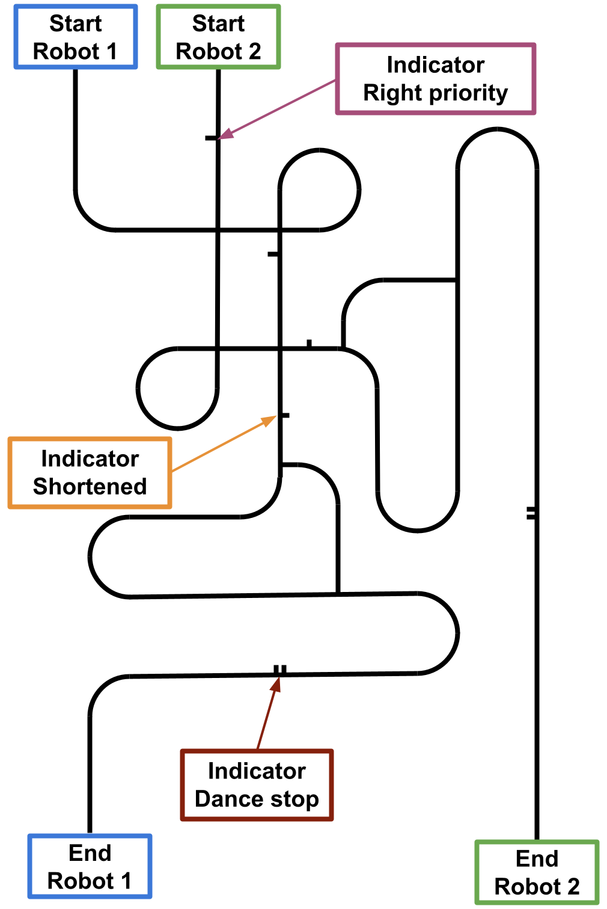
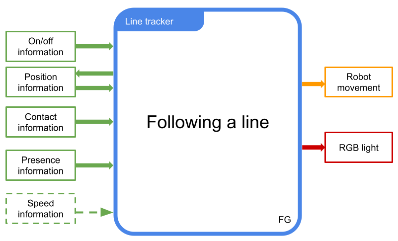
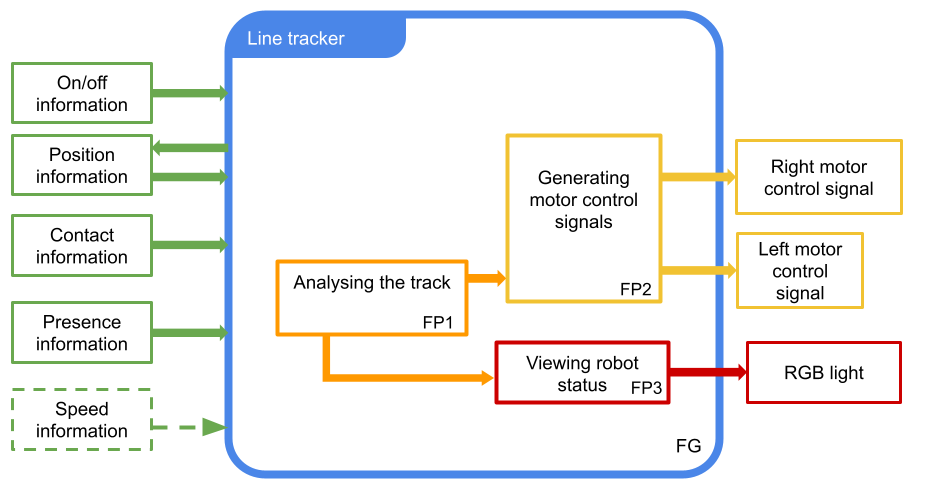
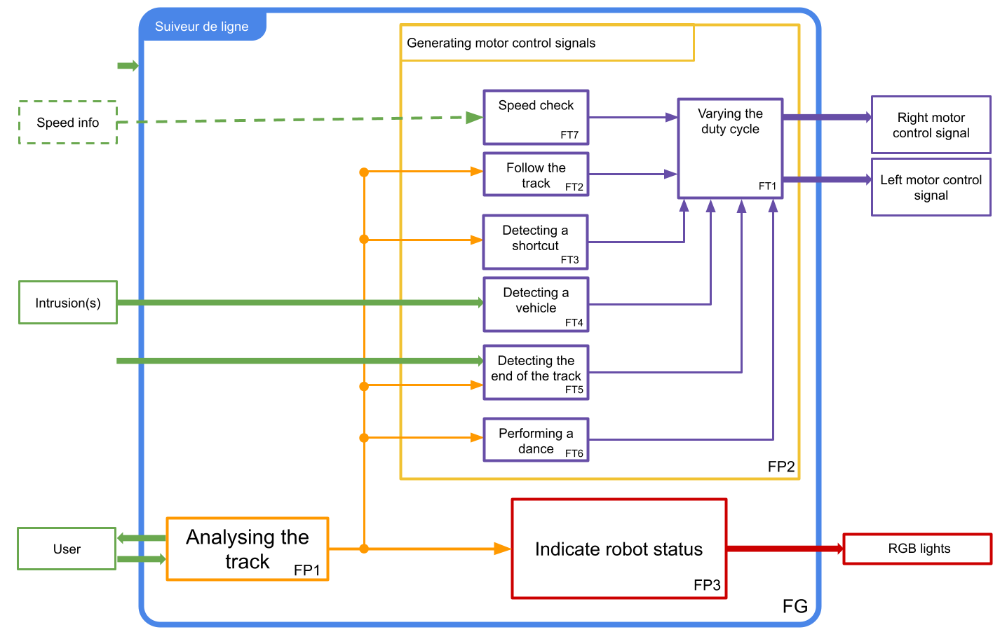

# Specific-Racing-Robot
Created by DAUNOIS Hugo and LANFREDI Camille 

## 📖 Table of contents

- [Objectifs](#Objectifs)
  - [Rules](#Rules)
  - [Components](#Components)
- [Specifications](#Specifications)
  - [Functional analysis](#Functional-analysis)
- [Development](#development)
  - [Analysing the track](#Analysing-the-track)    
  - [Generating motor control signals](#Generating-motor-control-signals)
    - [Varying the duty cycle](#Varying-the-duty-cycle)
    - [Following the trail](#Following-the-trail)
    - [Finding a shortcut](#Finding-a-shortcut)
    - [Vehicle detection](#Vehicle-detection)
    - [End of course](#End-of-course)
    - [Making a figure](#Making-a-figure)
  - [Visualise the state of the robot](#Visualise-the-state-of-the-robot)
  - [3D Modelisation](#3D-Modelisation)
  - [BONUS](#bonus)
- [Deliverables](#Deliverables)
- [Contributions](#contributions)

# Objectifs
Create digital racing robot
## Rules
### Article 1: Definition
The Line Follower Robot Competition is a speed race between two autonomous robots
robots on an enclosed track. The following rules define the characteristics of the track
and the robots.
### Article 2: Track characteristics
The game board is made from 6 plastic boards with a white, semi-smooth surface.
smooth surface. The lines are made with 2cm-wide black adhesive tape.
### Article 3: Robot specifications
The maximum dimensions of the robots are 20cm (length) x 20cm (width) x 15cm
(height). They must be made by the competitors and be completely autonomous. They must
have an easily accessible on/off switch. The robot will be started
by switch or push button. The energy source must be electrical,
batteries, etc.
### Article 4: How the competition works and how points are awarded
A robot is declared the **"winner"** when, having finished following its track, it drops a wooden bar
20 cm long and **stops on its own**. This bar is perpendicular to the end of the track.
the track. The ends of the bar are placed on two supports that keep it 4 cm above the ground (cf.
figure 2).

A second wooden bar is located 20 cm behind the first. If this second bar
falls, for whatever reason, the robot receives a **time penalty of 5 seconds**.
In addition, from the moment the first robot arrives, the second robot has ten seconds to
drop the final bar. After this time, the second robot is disqualified.
At the end of the round, the robot that took the least time (taking into account any time bonuses or
time bonuses and penalties) wins **3 points**. The 2nd robot, if it arrives before the time limit of 10
seconds, wins **one point**.

**Two minute rule:**
If no robot has arrived two minutes after the start, the round ends there.
### Article 5: Information on the road
#### Right priority:
A right priority indicator warns the non-priority robot that its lane will intersect that of the
priority robot. This indicator takes the form of a section of track perpendicular to the normal track.
to the normal lane, placed on the right-hand side of the lane about 15 cm before the intersection. The
length of the right priority indicator is approximately 5 cm.
At this intersection, the robot coming from the right has priority. The robot coming from the left must
give way to it. A robot that stops to give way to the right-hand side scores a point and receives a **time bonus of 5 seconds**. If there is no robot with priority, giving way does not
priority does not earn any points or time bonus.
#### Shortcuts:
On courses, shortcuts can be set up: their track always starts on the left, forming a right angle with the initial track. forming a right angle with the initial track. It is marked 15 cm ahead by a marker in the form of a 5 cm section of track at a right angle to the left of the initial track of the initial runway (see runway example). The normal runway is always resumed by a left turn. 
#### Stop figure :
The robot may encounter a stop marker. In this case, if the robot completes a turn it wins a point and receives a 5-second time bonus. The stop marker is made up of two sections of track perpendicular to the track, on the right-hand side on the right-hand side of the track, 5 cm long. The two strips are approximately 2 cm apart.
### Article 6: Problems during the race - Allocation of penalties and points
#### Robot(s) lost:
Robots must follow the line corresponding to their course in the correct direction. When a robot does not follow the line for more than ten seconds, it is considered lost. If the lost robot finds its track in the right direction, it is no longer considered lost. Furthermore, in the event of a collision, a lost robot is never considered to have priority. If both robots are lost for more than 10 seconds, the round stops. No robot will be considered to have arrived, but the points scored at the start of the round are retained.
#### False finish :
When a robot A loses and knocks down the final bar of its opponent B, it is considered that B arrived without knocking down the second bar and A never arrived. B therefore receives three points, but B continues his race to the end of his runway and collects points until the end, even though he is already considered to be the winner even though he is already considered to have arrived. If possible, robot A should be removed from the track before robot B joins it in order to avoid a collision.
When a robot A is lost and it disrupts a feature of its opponent B's course, other than the final bar, and which could have earned points for its opponent B, the maximum points associated with this feature are automatically given to B.
### Article 7:Various collisions
A collision is considered to have occurred when a priority robot is likely to be hindered by clear contact
with a non-priority robot.
  - When there is simple contact without the priority robot appearing to be unduly disturbed, there is no collision.
  - When there is a single contact without the priority robot appearing to be unduly disturbed, the continues normally, regardless of the state of the non-priority robot. However, therobot receives a **time penalty of 5s**.
  - In the event of a collision, the robot at fault scores no points in this round. The robot that has been hindered plays the round again on its own.
  - In the event of a collision between two lost robots, the round ends with neither robot scoring any points for that round.

Robots must not deliberately try to cause collisions, whether or not they have priority, whether actively or passively. In particular, countermeasures to prevent a robot from being detected are forbidden. A robot that does not comply with this
rule may be immediately excluded from the competition.

For details go check the rules (it's in french) : [Race's rules](Suiveur-de-Ligne-V3.1.pdf)
### Components
[List of components](List-of-components.md)
# Specifications
## Functional analysis
### Order 1

### Order 2

### Order 3

# Development
All the functions will be implemented using an Arduino mega board with an atmega2560. This board offers us a wide range of possibilities, thanks in particular to all its available ports such as its 5 programmable timers and its many interrupt ports. This will be useful for the rest of the project. To make it easier to connect to the board, we plugged a Grove Shield into the Arduino board. This module allows us to interface all our sensors simply using 4 wires that include the power supply (Vcc, GND) and two Arduino ports (digital, i2c, analogue, etc.).
## Analysing the track
The robot must be able to find its way around the track. To do this, it will emit to probe the ground and it will pick up the waves reflected by the runway. This will analyse the runway. So we have a QTR-8RC module. 

This module has 8 infrared sensors and is made up of phototransistors and light-emitting diodes (LEDs) arranged in pairs. These pairs of LEDs are connected in series. This halves current consumption. It also has a MOSFET transistor to switch off the LEDs for better energy management. However we won't be using it because it takes longer to measure. Each sensor provides an independent
digital output. 

The current-limiting resistors are adapted for 5 V operation by means of two resistors in parallel. By shunting the two resistors, this allows operation at 3.3 V operation (bypass). The current is between 20-25 mA per pair of LEDs. The module therefore has a total consumption of 100mA.

picture

These sensors are powered by the Vcc and GND pins on the Arduino Mega. To use them, we need to add their library named ***QTRSensors.h*** to the Arduino programming software.

Once, the sensors are connected to Arduino we define the number of sensors as well as their types. In our case, we are using digital outputs.

picture

After calibrating them, i.e. moving the sensors on the track so that they can tell the difference between black and white, we can use the readlineblack function.  This allows us to detect the position of the line between 0 and 7000 (because we have 8 sensors). The position is estimated from a weighted average of the sensor indices multiplied by 1000, i.e. 0 on sensor 0, 1000 on sensor 1, etc. It also returns the reflection of each sensor in an array called SensorValue. We can see that each time a sensor transmits on the track it returns the location of the line in relation to all the sensors. (See: "Position of the track relative sensors" below).

picture

After several tests, we realised that when the robot passes over an indicator, the position is wrong. the position is wrong. As this image shows:

picture

We therefore need to analyse the sensor data to determine whether we are following the line or detecting an indicator.
To do this, we're going to count the number of sensors that have a reflectance above a certain threshold. This will tell us which mode the robot is in the track.

picture

But this method is incomplete. It is not possible to distinguish whether the indicator is on the right or the left. We have therefore drawn up the following table:

picture

As we can see, it is the high index sensors that detect the presence of a on the right. For the indicator on the left, it's the low index sensors. However, since as tracking is not perfect, this will rarely be the case. That's why, to anticipate all possible cases possible cases, we average the sensor indices over the black.

picture

So, from this average we can deduce the position of each indicator on the track.

We have therefore created the following programme:

picture

To find out which mode we're in, we use two variables: average and BlackCount.

BlackCount allows us to determine the number of sensors positioned on black. Using this information, we can deduce the robot's position. If the robot is completely on black or white, if it must follow the line (1 or 2 sensors) and finally if there are any
indicators.

To find out where the indicators are, we use the average variable.
This allows us to calculate the average of the sensors transmitting on black. We can therefore deduce whether the indicator is positioned on the right-hand side of the circuit (low average) or on the left-hand side (high average).

To make the connection between the Arduino mega and the QTR-8RC module, we need to create an
electronic board. To do this, we use the Eagle software.

To ensure that this board has the same footprint as that of the Arduino mega, we are using the
schematic of a Grove Mega Shield version 0.9 module.
We use a PL1 connector that allows all the sensors to be interfaced with a single cable.
library: con-harting-v and a Grove connector to link with the QTR-8RC module and the Arduino mega's power supply pins.

picture
picture

## Generating motor control signals
The track is complex, meaning that the robot's tracking is not limited to following a line. As a result, there are several factors that change the speed of the motors. So there are several functions. The aim of this main function is to be able to vary the speed of the motors according to different situations on the track.
### Varying the duty cycle
This function is one of the most important. It enables the motors to be controlled according to the instructions sent by the other FTs. To manage the motors, we use the Motor Shield.
This module is based on the L298P component, which incorporates a double H-bridge that enables two motors to be controlled independently. It can also control the direction of these motors.
To control the speed of the motors, two square-wave variable duty cycle (PWM) for each motor. To generate these two PWM and avoid taking up too much processor time, we use Timers. Timers allow us to generate PWM signals while doing other things. To use them, we use the ***TimerOne*** and ***TimerThree*** libraries, which work in the same way. the same way.
### Following the trail
### Finding a shortcut
### Vehicle detection
### End of course
### Making a figure
## Visualise the state of the robot
## 3D Modelisation
# Deliverables
# Contributions
-
-
