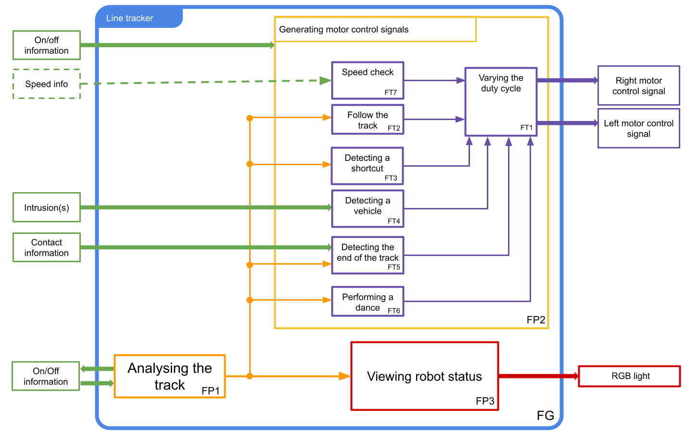

# Specific-Racing-Robot
Created by DAUNOIS Hugo and LANFREDI Camille 

## 📖 Table of contents

- [Objectifs](#-Objectifs)
  - [Rules](#Rules)
  - [Components](#Components)
- [Specifications](#Specifications)
  - [Functional analysis](#Functional-analysis)
  - [Development](#development)
  - [3D Modelisation](#3D-Modelisation)
  - [BONUS](#bonus)
- [Deliverables](#Deliverables)
- [Contributions](#-contributions)

# Objectifs
Create digital racing robot
## Rules
### Article 1: Definition
The Line Follower Robot Competition is a speed race between two autonomous robots
robots on an enclosed track. The following rules define the characteristics of the track
and the robots.
### Article 2: Track characteristics
The game board is made from 6 plastic boards with a white, semi-smooth surface.
smooth surface. The lines are made with 2cm-wide black adhesive tape.
### Article 3: Robot specifications
The maximum dimensions of the robots are 20cm (length) x 20cm (width) x 15cm
(height). They must be made by the competitors and be completely autonomous. They must
have an easily accessible on/off switch. The robot will be started
by switch or push button. The energy source must be electrical,
batteries, etc.
### Article 4: How the competition works and how points are awarded
A robot is declared the **"winner"** when, having finished following its track, it drops a wooden bar
20 cm long and **stops on its own**. This bar is perpendicular to the end of the track.
the track. The ends of the bar are placed on two supports that keep it 4 cm above the ground (cf.
figure 2).

A second wooden bar is located 20 cm behind the first. If this second bar
falls, for whatever reason, the robot receives a **time penalty of 5 seconds**.
In addition, from the moment the first robot arrives, the second robot has ten seconds to
drop the final bar. After this time, the second robot is disqualified.
At the end of the round, the robot that took the least time (taking into account any time bonuses or
time bonuses and penalties) wins **3 points**. The 2nd robot, if it arrives before the time limit of 10
seconds, wins **one point**.

**Two minute rule:**
If no robot has arrived two minutes after the start, the round ends there.
### Article 5: Information on the road
#### Right priority:
A right priority indicator warns the non-priority robot that its lane will intersect that of the
priority robot. This indicator takes the form of a section of track perpendicular to the normal track.
to the normal lane, placed on the right-hand side of the lane about 15 cm before the intersection. The
length of the right priority indicator is approximately 5 cm.
At this intersection, the robot coming from the right has priority. The robot coming from the left must
give way to it. A robot that stops to give way to the right-hand side scores a point and receives a **time bonus of 5 seconds**. If there is no robot with priority, giving way does not
priority does not earn any points or time bonus.
#### Shortcuts:
On courses, shortcuts can be set up: their track always starts on the left, forming a right angle with the initial track. forming a right angle with the initial track. It is marked 15 cm ahead by a marker in the form of a 5 cm section of track at a right angle to the left of the initial track of the initial runway (see runway example). The normal runway is always resumed by a left turn. 
#### Stop figure :
The robot may encounter a stop marker. In this case, if the robot completes a turn it wins a point and receives a 5-second time bonus. The stop marker is made up of two sections of track perpendicular to the track, on the right-hand side on the right-hand side of the track, 5 cm long. The two strips are approximately 2 cm apart.
### Article 6: Problems during the race - Allocation of penalties and points
#### Robot(s) lost:
Robots must follow the line corresponding to their course in the correct direction. When a robot does not follow the line for more than ten seconds, it is considered lost. If the lost robot finds its track in the right direction, it is no longer considered lost. Furthermore, in the event of a collision, a lost robot is never considered to have priority. If both robots are lost for more than 10 seconds, the round stops. No robot will be considered to have arrived, but the points scored at the start of the round are retained.
#### False finish :
When a robot A loses and knocks down the final bar of its opponent B, it is considered that B arrived without knocking down the second bar and A never arrived. B therefore receives three points, but B continues his race to the end of his runway and collects points until the end, even though he is already considered to be the winner even though he is already considered to have arrived. If possible, robot A should be removed from the track before robot B joins it in order to avoid a collision.
When a robot A is lost and it disrupts a feature of its opponent B's course, other than the final bar, and which could have earned points for its opponent B, the maximum points associated with this feature are automatically given to B.
### Article 7:Various collisions
A collision is considered to have occurred when a priority robot is likely to be hindered by clear contact
with a non-priority robot.
  - When there is simple contact without the priority robot appearing to be unduly disturbed, there is no collision.
  - When there is a single contact without the priority robot appearing to be unduly disturbed, the continues normally, regardless of the state of the non-priority robot. However, therobot receives a **time penalty of 5s**.
  - In the event of a collision, the robot at fault scores no points in this round. The robot that has been hindered plays the round again on its own.
  - In the event of a collision between two lost robots, the round ends with neither robot scoring any points for that round.

Robots must not deliberately try to cause collisions, whether or not they have priority, whether actively or passively. In particular, countermeasures to prevent a robot from being detected are forbidden. A robot that does not comply with this
rule may be immediately excluded from the competition.

For details go check the rules (it's in french) : [Race's rules](Suiveur-de-Ligne-V3.1.pdf)
### Components
[List of components](List-of-components.md)
# Specifications
## Functional analysis
### Order 1

### Order 2

### Order 3

## Development
### Analysing the track
### Generating motor control signals
### Varying the duty cycle
### Following the trail
### Finding a shortcut
### Vehicle detection
### End of course
### Bonus : Making a figure
### Visualise the state of the robot
## 3D Modelisation
# Deliverables
# Contributions
-
-
